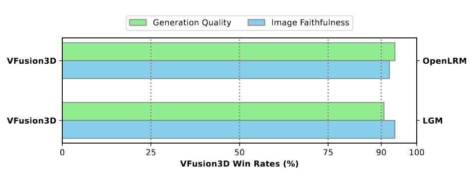

# [ECCV 2024] VFusion3D: Learning Scalable 3D Generative Models from Video Diffusion Models

[Porject page](https://junlinhan.github.io/projects/vfusion3d.html), [Paper link](https://arxiv.org/abs/2403.12034)

VFusion3D is a large, feed-forward 3D generative model trained with a small amount of 3D data and a large volume of synthetic multi-view data. It is the first work exploring scalable 3D generative/reconstruction models as a step towards a 3D foundation.

[VFusion3D: Learning Scalable 3D Generative Models from Video Diffusion Models](https://junlinhan.github.io/projects/vfusion3d.html)<br>
[Junlin Han](https://junlinhan.github.io/), [Filippos Kokkinos](https://www.fkokkinos.com/), [Philip Torr](https://www.robots.ox.ac.uk/~phst/)<br>
GenAI, Meta and TVG, University of Oxford<br>
European Conference on Computer Vision (ECCV), 2024


## News

- [25.07.2024] Release weights and inference code for VFusion3D.

## Results and Comparisons

### 3D Generation Results


### User Study Results



## Setup

### Installation
```
git clone https://github.com/facebookresearch/vfusion3d
cd vfusion3d
```

### Environment
We provide a simple installation script that, by default, sets up a conda environment with Python 3.8.19, PyTorch 2.3, and CUDA 12.1. Similar package versions should also work.

```
source install.sh
```

## Quick Start

### Pretrained Models

- Model weights are available here [Google Drive](https://drive.google.com/file/d/1b-KKSh9VquJdzmXzZBE4nKbXnbeua42X/view?usp=sharing). Please download it and put it inside ./checkpoints/


### Prepare Images
- We put some sample inputs under `assets/40_prompt_images`, which is the 40 MVDream prompt images used in the paper. Results of them are also provided under `results/40_prompt_images_provided`. 

### Inference
- Run the inference script to get 3D assets.
- You may specify which form of output to generate by setting the flags `--export_video` and `--export_mesh`.
- Change `--source_path` and `--dump_path` if you want to run it on other image folders. 

    ```
    # Example usages
    # Render a video
    python -m lrm.inferrer --export_video --resume ./checkpoints/vfusion3dckpt
    
    # Export mesh
    python -m lrm.inferrer --export_mesh --resume ./checkpoints/vfusion3dckpt
    ```


## Acknowledgement

- This inference code of VFusion3D heavily borrows from [OpenLRM](https://github.com/3DTopia/OpenLRM).  

## Citation

If you find this work useful, please cite us:


```
@article{han2024vfusion3d,
  title={VFusion3D: Learning Scalable 3D Generative Models from Video Diffusion Models},
  author={Junlin Han and Filippos Kokkinos and Philip Torr},
  journal={European Conference on Computer Vision (ECCV)},
  year={2024}
}
```

## License

- The majority of VFusion3D is licensed under CC-BY-NC, however portions of the project are available under separate license terms: OpenLRM as a whole is licensed under the Apache License, Version 2.0, while certain components are covered by NVIDIA's proprietary license.
- The model weights of VFusion3D is also licensed under CC-BY-NC.
